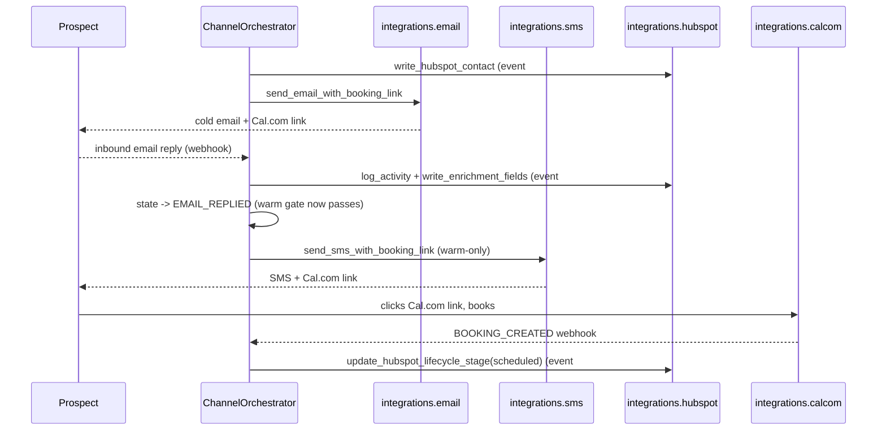

# Architecture — The Conversion Engine

This is the canonical architecture diagram for the system. The README embeds the same Mermaid block; this file is the standalone version a reader can land on directly from a link.

## Full data flow

```mermaid
flowchart TB
    subgraph SOURCES["Public data sources"]
        D1[(Crunchbase ODM<br/>CSV — Apache 2.0)]
        D2[(BuiltIn / Wellfound /<br/>LinkedIn public / Indeed)]
        D3[(layoffs.fyi CSV)]
        D4[(DuckDuckGo Instant<br/>Answer API — public news)]
        D5[(GitHub Search API)]
    end

    subgraph SIGNAL["signals/  -  enrichment"]
        S1[crunchbase/<br/>ODM lookup +<br/>funding-round filter]
        S2[job_posts/<br/>4 scrapers + 60d delta]
        S3[layoffs/<br/>CSV parser + 365d window]
        S4[leadership/<br/>news + ODM cross-ref]
        S6[compliance.py<br/>robots.txt cache]
    end

    subgraph SCORE["scoring/ai_maturity/"]
        SC1[6 collectors<br/>HIGH/MED/LOW tiers]
        SC2[bucketing 0..3<br/>weighted_total -> int]
        SC3[silent-company<br/>branch + note]
        SC4[persist rationale<br/>to eval/scoring_rationales/]
    end

    subgraph BRIEFS["briefs/competitor/"]
        B1[selection.py<br/>5..10 top-quartile]
        B2[distribution.py<br/>percentile/rank]
        B3[generator.py<br/>schemas/competitor_gap_brief]
    end

    subgraph ORCH["orchestration/<br/>ChannelOrchestrator"]
        O1{state machine<br/>cold -> sent -> reply -><br/>warm -> sms -> book -> close}
        O2[warm-lead gate<br/>SMS gated on email reply]
    end

    subgraph CHAN["integrations/  -  production stack"]
        C1[email/<br/>Resend send +<br/>send_email_with_booking_link]
        C2[sms/<br/>AT send +<br/>send_sms_with_booking_link]
        C3[hubspot/<br/>contact + activity +<br/>enrichment + lifecycle]
        C4[calcom/<br/>generate_booking_link +<br/>handle_booking_confirmed]
    end

    subgraph LLM["LLM backbone (OpenRouter)"]
        L1[gpt-4.1<br/>production]
        L2[gpt-4o-mini<br/>eval]
    end

    subgraph OBS["Observability layer"]
        OB1[Langfuse cloud<br/>traces + cost + latency]
        OB2[eval/trace_log.jsonl<br/>local fallback]
        OB3[artifacts/logs/<br/>webhook_events.jsonl]
        OB4[eval/score_log.json<br/>pass@1 history]
        OB5[eval/scoring_rationales/<br/>per-prospect AI maturity]
    end

    D1 --> S1
    D2 --> S2
    D3 --> S3
    D4 --> S4
    D5 --> SC1
    S6 -.gates.-> S2

    S1 --> SC1
    S2 --> SC1
    S3 --> SC1
    S4 --> SC1
    SC1 --> SC2 --> SC3 --> SC4

    SC2 --> B1
    B1 --> B2 --> B3

    SC2 --> O1
    B3 --> O1
    O1 --> O2
    O1 --> C1
    O1 --> C2
    O1 --> C3
    O1 --> C4

    C1 --> L1
    C2 --> L1
    C1 -.eval.-> L2

    C1 -.trace.-> OB1
    C2 -.trace.-> OB1
    C3 -.trace.-> OB1
    C4 -.trace.-> OB1
    SC4 -.persist.-> OB5
    L1 -.cost+latency.-> OB1
    OB1 -.fallback.-> OB2
    OB1 -.aggregate.-> OB4

    classDef src fill:#e8f4f8,stroke:#3399cc
    classDef sig fill:#f4f4f4,stroke:#666
    classDef obs fill:#fff7e0,stroke:#cc9900
    classDef llm fill:#f0e8f8,stroke:#9966cc
    class SOURCES src
    class SIGNAL,SCORE,BRIEFS,ORCH,CHAN sig
    class OBS obs
    class LLM llm
```

## Reading the diagram

The system is one prospect-thread agent loop wrapped in a multi-channel production stack:

- **Public sources** (Crunchbase ODM, layoffs.fyi, DuckDuckGo, GitHub Search) are the only inputs — no proprietary scraping, no authenticated APIs.
- **`signals/`** packages collect each source independently. `compliance.py` is the gate every scraper passes through before any URL fetch.
- **`scoring/ai_maturity/`** turns the signal bundle into a 0..3 integer score plus a per-signal justification map. The silent-company branch is the explicit "absence is not proof of absence" case.
- **`briefs/competitor/`** uses the same scorer against 5..10 sector competitors and computes the prospect's distribution position.
- **`orchestration/ChannelOrchestrator`** is the single state machine. Every cross-channel decision (warm-lead gate, HubSpot multi-event writes, Cal.com dispatch from email and SMS) lives here.
- **`integrations/`** packages call the underlying APIs. Each channel imports the Cal.com booking-link generator from `integrations.calcom`, so the booking link is produced through client code rather than hard-coded.
- **LLM backbone** is gpt-4.1 for production and gpt-4o-mini for evaluation, both via OpenRouter.
- **Observability layer** captures Langfuse traces (cost + latency), webhook events, score-log history, and per-prospect scoring rationales. Every production action emits at least one observability event.

## Channel-handoff sequence



The diagram makes the two rubric checks explicit:

- **B5 (warm-lead gate)** — the SMS arrow only fires after `state -> EMAIL_REPLIED`.
- **B9 (HubSpot at multiple event points)** — three distinct `H` arrows: contact create, activity log, lifecycle update.
- **B12 (Cal.com from both channels)** — both `E` and `S` invoke `generate_booking_link` from `integrations.calcom`.
